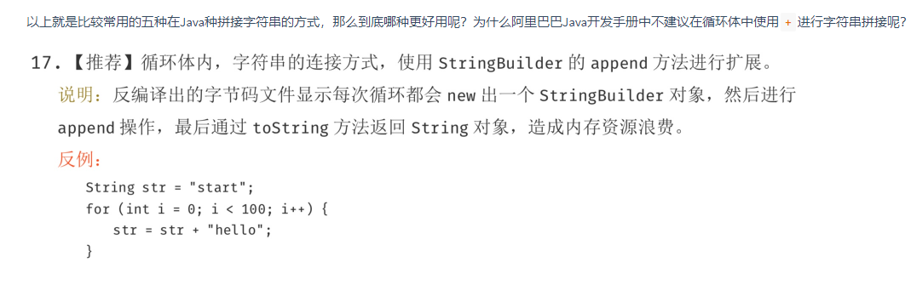

# ArrayList：
数组，查询快，增删慢。
线程不安全，效率高。
扩容1.5倍，
int newCapacity = oldCapacity + (oldCapacity >> 1)
不要在foreach里add，delete。因为底层用到了Iterator，有fail-fast校验，会抛出CME（ConcurrentModificationException），并发的错误。除非删了一个立刻break。但普通for循环可以。

# Vector：
数组。查询快，增删慢。
线程安全，效率低。
相对ArrayList查询慢（线程安全原因）
相对LinkedList增删慢（数组结构原因）
默认扩容2倍（如果capacityIncrement有的话就是扩多少）：
 int newCapacity = oldCapacity + ((capacityIncrement > 0) ? capacityIncrement : oldCapacity)
 
如果你要在集合中保存大量的数据那么使用Vector有一些优势，因为你可以通过设置集合的初始化大小来避免不必要的资源开销。

# LinkedList：
链表，查询慢，增删快。
线程不安全，效率高。
实现了Queue接口。

# String：
慢。字符串常量池，jdk7前是永久带。jdk7是堆内存，jdk8是元空间。
## string的长度限制
编译时不超过65535，运行时不能超过int的范围

# StringBuilder：
线程不安全，适合单线程
+对字符串的拼接，实际上是是用了StringBuilder.append

# StringBuffer：
线程安全。因为他很多方法都有synchrond关键字。

1、如果不是在循环体中进行字符串拼接的话，直接使用+就好了。2、如果在并发场景中进行字符串拼接的话，要使用StringBuffer来代替StringBuilder。

# TreeMap
底层实现红黑树

# HashTable:
线程安全，
不能存储null值（key和value都不可以）
默认大小是11，增加办法是2n+1
遍历使用Enumeration，也可Iterator 

# HashMap:
线程不安全，当并发put时死循环。（jdk8修复）
可以存储null值（key和value都可以）
默认是16，一定是2的指数。扩容2倍
遍历使用Iterator
jdk7时，数组+链表
jdk8时，数组+链表（红黑树（节点≥8））

## 参数
#### size
#### loadfactor
装载因子，<1。 用来衡量满的程度。默认0.75 。因为3/4*2的指数，一般都是整数。
#### threshold
临界值， threshold=容量*装载因子
#### capacity
如不指定，默认16。但就算指定1，capacity会是2。要是2的指数

## jdk1.7和jdk1.8
### jdk1.7
数组+链表，
get性能最好O(1),最差O（n）
两步，一步hash就是将object转成int，一步indexfor找下标。
hash：
因为位运算代替取模，会引起哈希分布不均匀，为解决为题，进行了扰动。
indexfor：
h & (length-1);实际上就是取模，只要长度是2的幂
X % 2^n = X & (2^n - 1)。
用位运算，除了性能好点，快点以外，还可以保证了正数。
### jdk1.8
数组+平衡树
get性能最好O(n),最差O（logn）

# ConcurrentHashMap：
jdk6,7时，使用segment，put时锁住segment，get不加，使用volatile保证可见性。
jdk8，使用node。使用synchronize。利用CAS算法。
不能替代hashtable。虽然迭代时，只锁一部分，性能更好，hashtable锁整个。但hashtable迭代器强一致性，concurrenthashmap弱一致性。

# HashSet:
底层实现是hashmap
允许放入null，但只能放入一个
线程不安全，保证元素唯一性用hashcode和equals

# TreeSet:
底层实现treemap
有序的
不允许放入null值
线程不安全，保证元素唯一性用compareTo和compare

# Collection 和 Collections:
Collection是集合类的上级接口，Collections是集合类的帮助类。

