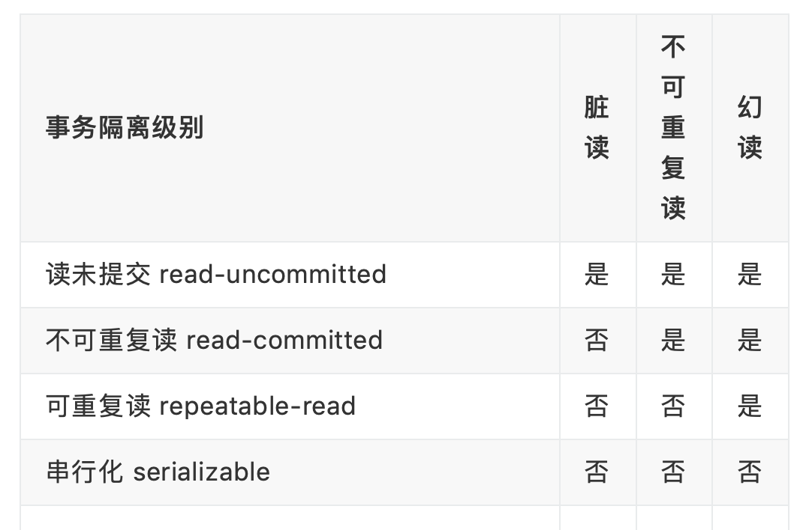

# 事务四大特性：ACID
## 原子性 Atomicity
事务是最小的执行单位，不允许分割。要么全部成功，要么全部失败。靠undo log日志保证
## 一致性 Consistency
事务前后，数据保持一致。由代码保证
## 隔离性 Isolation          
由MVCC保证，多版本并发控制，简单说就是快照
并发事务相互隔离。
## 持久性 Durability       
事务一旦提交，对数据库的影响是永久的。就是故障也不会丢失提交的事务。由内存+redo log保证
# 并发事务有啥问题
## 脏读
A读了数据，B正在修改未提交，A读到的就是脏数据。
## 丢失修改
A和B都读了数据，都做了修改，造成一个修改丢失。
## 不可重复读
A读很多次，其间B更新了，多次读取的数据不一致，侧重修改，要解决只需锁住行。
## 幻读
A把1改成2 ，B插入1， 读取的时候还是1，像幻觉，侧重增加或删除。要解决要锁住表
# 事务的隔离级别

Mysql支持4种级别，默认级别是 可重复读（就是默认锁行了？）
oracle支持读已提交和串行化
# mysql的存储引擎的区别（InnoDB/MyISAM/MEMORY）
MyISAM是MySQL的默认数据库引擎（5.5版之前），之后是InnoDB。
## 存储结构：
### MyISAM：
每个MyISAM在磁盘上存储成三个文件。
### InnoDB：
所有的表都保存在同一个数据文件中
## 存储空间：
### MyISAM：
较小
### InnoDB：
更大
## 事务支持：
### MyISAM：
强调的是性能，执行数度更快，但是不提供事务支持。
### InnoDB：
提供事务支持事务。
## AUTO_INCREMENT：
### MyISAM：
引擎的自动增长列必须是索引，如果是组合索引，自动增长可以不是第一列，
### InnoDB：
引擎的自动增长列必须是索引，如果是组合索引也必须是组合索引的第一列。
## FULLTEXT:
### MyISAM：
支持
### InnoDB：
不支持
## 表锁差异
### MyISAM：
只支持表级锁。
### InnoDB：
支持事务和行级锁，但是InnoDB的行锁，只是在WHERE的主键是有效的，非主键的WHERE都会锁全表的。
## 表的具体行数：
### MyISAM：
保存有表的总行数，如果select count(*) from table;会直接取出出该值。
### InnoDB：
没有保存表的总行数，如果使用select count(*) from table；就会遍历整个表，消耗相当大，但是在加了wehre条件后，myisam和innodb处理的方式都一样。 
## CURD操作：
### MyISAM：
如果执行大量的SELECT，MyISAM是更好的选择
### InnoDB
如果你的数据执行大量的INSERT或UPDATE，出于性能方面的考虑，应该使用InnoDB表。DELETE 从性能上InnoDB更优，但DELETE FROM table时，InnoDB不会重新建立表，而是一行一行的删除，myISAM会重新建表。
## 外键：
### MyISAM：
不支持
### InnoDB：
支持
# mysql的b+ tree索引和hash索引的区别
hash索引：
MySQL中，只有HEAP/MEMORY引擎才显示支持Hash索引。
只满足=，in，《=》，不能用于范围查询，不能用于排序。
不能利用部分索引查询
不能避免表扫描
# 最左索引：多列索引中，看第一列。
# 多索引的弊端：
内存。修改的时候要同时更新，降低性能
# 聚集索引和非聚集索引
根本区别是索引表记录的顺序和索引的顺序是否一致，innodb是基于聚簇索引
# 锁的分类
mysql锁分为共享锁和排它锁，也叫读锁和写锁。
## 共享锁（读锁）
通过lock in share mode
## 排它锁（写锁）
分为
### 表锁
不会死锁
和
### 行锁
会死锁
行锁又分
#### 乐观锁
乐观锁先操作，最后更新数据的时候再拿锁。用版本号实现。响应速度更快，重试代价大。一般做法是在数据上增加版本号或时间戳。乐观锁适合取锁失败概率小的，再业务操作中无法和数据库保持连接的。
和
#### 悲观锁
先获取锁，再进行操作。用for update实现。MySQL还有个问题是select for update语句执行中所有扫描过的行都会被锁上，这一点很容易造成问题。因此如果在MySQL中用悲观锁务必要确定走了索引，而不是全表扫描。select for update获取的行锁会在当前事务结束时自动释放，因此必须在事务中使用。
>总结：这两种锁都用来保证数据并发安全，防止更新丢失。用哪个锁可以从响应速度，冲突频率，重试代价去考虑。
和
### 页面锁
会死锁
# 非关系型数据库和关系型数据库
## 非关系型数据库（NOSQL）：
（可以假想成redis），基于键值对的，性能高。数据没有耦合，非常容易扩展。
## 关系型数据库：
可以在一个表或多个表做复杂的查询，安全性能更高。
>总结：MONGODB是非关系型数据库，已经开始具备复杂查询功能。
>对于事物，也可以用乐观锁的方式曲线救国，例如redis的setnx
# 数据库的范式
## 第一范式
表中每个字段都不可分解。
## 第二范式
每列都和主键相关（针对联合主键）
## 第三范式
每列都和主键列直接相关。
# 主从复制
## 同步复制
就是master更新后，slave完成后才返回，所以时间很长。
## 异步复制
master完成就可以。
## 半同步复制
只保证slave的一个操作成功
# 死锁
## 条件 

- 互斥
- 请求和保持
- 不可剥夺
- 循环等待

## 解决办法
 - （互斥）：尽量少用互斥锁，能用读锁，就不用写锁。
 - （请求和保持）：采用资源静态分配策略，就是进程建立时就分配好了资源，尽量不请求多个锁，或者有一个锁又请求不到另一个锁时，先释放资源
 - （不可剥夺）：允许剥夺，设置进程优先级
 - （循环等待）：设置超时时间
 - kill线程
 - 设置锁的超时时间

# varchar和char
char定长，varchar不定，存取速度char更快，空间换时间。char英文占1字节，汉字占2字节。varchar英文占2字节，汉字占2字节。
# 高并发
分库 分表 分布式（集群） 二级缓存
# undo和redo
## undo
是为了原子性和持久化，用undo实现MVCC。操作任何数据之前，先把数据备份（undo log），再修改。如果出错rollback，就用undo log恢复到事务之前。缺点是，操作数据前将undo log写入磁盘，导致大量磁盘IO,降低性能。
## redo
是记录的新数据的备份。
# 数据切分
## 垂直分表
### 优点：
避免跨页，如果一行数据很多，就可能跨页，造成性能开销。数据库加载到内存时，以行为单位，可以多加几行，命中率高，减少磁盘IO。
解耦合，利于维护
### 缺点：
分布式事务复杂单表数据量还是很大。
## 水平分表（库内分表or分库分表，最好分库分表）
### 优点
应用端改动小不存在单库数据量大，高并发的性能瓶颈
### 缺点：
跨库不好join
数据多次扩展难度大
跨分片不好保证事务一致性
### 分片规则:
#### 按顺序
##### 优点：
单表大小可控，便于水平扩展，便于查找          
##### 缺点：
热点数据呗频繁读写，成为性能瓶颈
#### hash取模
##### 优点:
分的均匀，不容易出现热点和并发访问的瓶颈           
##### 缺点：
扩容迁移困难（重新取模?）,跨分片查询复杂。
## 分库分表的问题：
### 事务一致性
分布式事务导致发生冲突或思索的概率增高
最终一致性
### 跨节点关联查询join
解决办法：
### 主键问题
#### 解决办法：
Uuid,缺点长，占空间
维护一个id表。缺点强依赖db，存在单点问题。
sonwflake分布式自增id算法。缺点强依赖机器时钟，如果时钟回拨，可能id重复。
leaf，美团的分布式id生成系统，比较成熟，高可用，容灾，分布下时钟。
### 数据迁移和扩容的问题。
数据范围分片，就添加节点。取模的话就比较复杂。
# sql优化：
不要在where后面用!=或&lt;&gt;

