# 单例模式
要做什么：就是只能创建一个实例对象
怎么做：因为创建对象要通过构造方法，所以构造方法搞成私有的，然后再提供一个静态的方法调用构造方法。
## 饿汉式
饿汉就是啥也不管，先实例一个。  
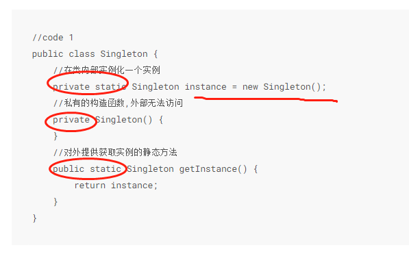  
但如果实例不被用到，饿汉会造成不必要的消耗，如果多次加载也会多次实例化。因此可用静态内部类或懒汉。  
## 静态内部类
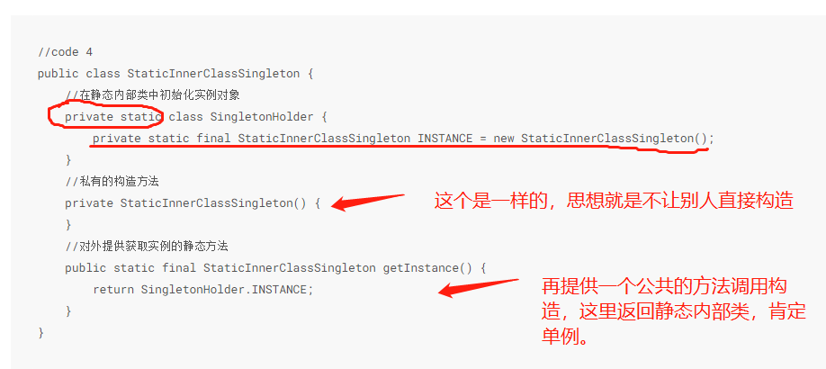  
## 懒汉式
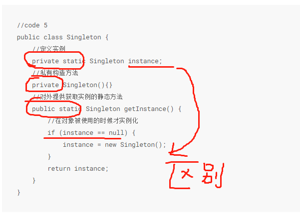  
但可能存在线程安全问题，比如两个线程同时进入if，就会创建两个对象。  
## 线程安全的懒汉式
给懒汉的getInstance整个方法加锁，简单粗暴  
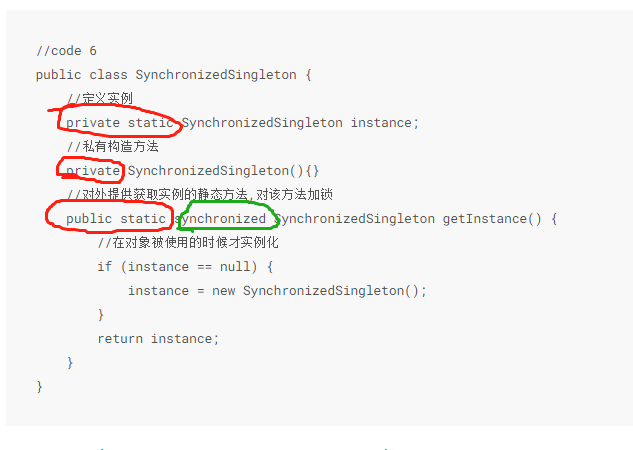    
但这样效率很低，比如不是第一次创建的时候其实直接return就好了但他也要同步。  
## 双重锁的懒汉式
缩小锁的范围，在方法里面加锁。同步代码块，不是第一次创建就直接return。
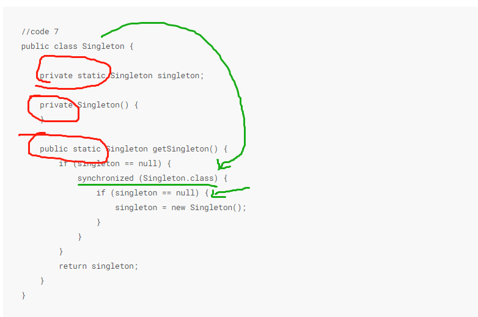  
但这样，因为JMM（java内存模型），会存在一致性的问题。 
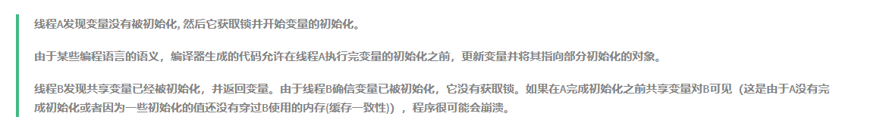  
这种多线程的共享变量可以用volatile.
## 使用volatile的双重锁懒汉
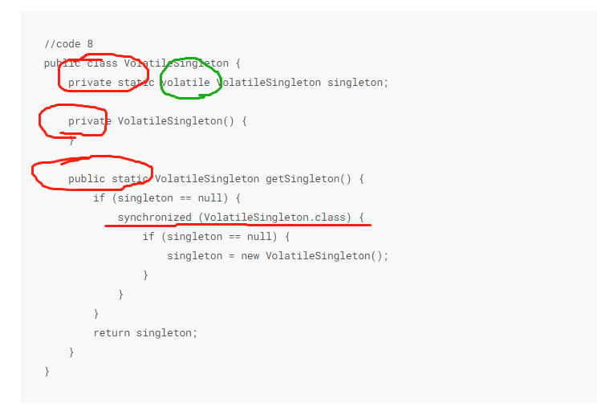  
但他存在序列化的问题  
## 使用final
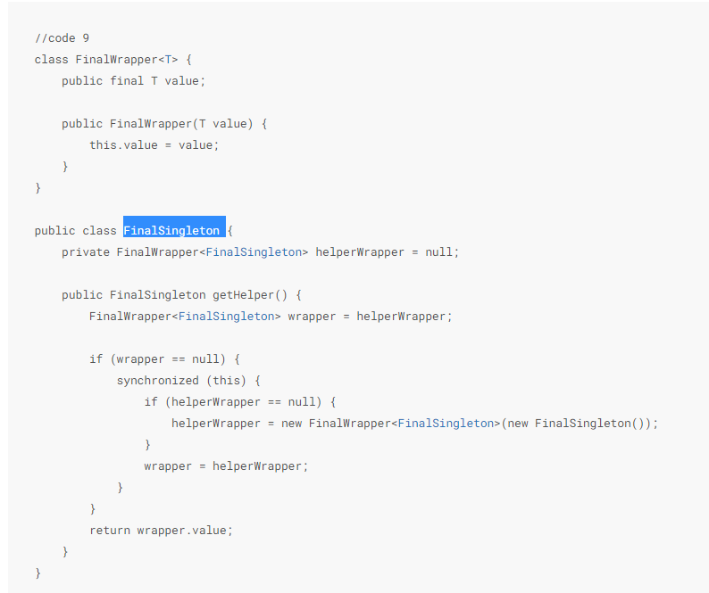 
## 使用枚举
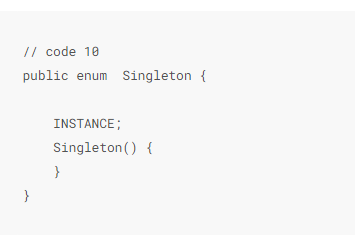  
enum其实也就是个final类。
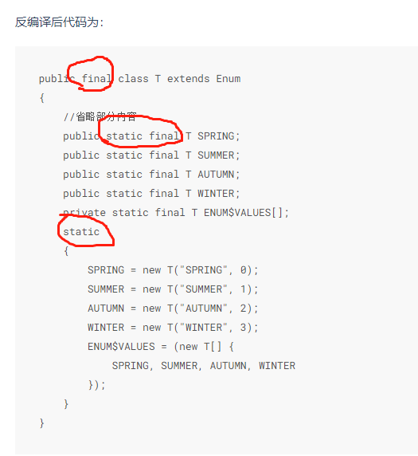  

反射会破坏单例  
序列化也会破坏单例  
只要在Singleton类中定义readResolve就可以解决该问题  
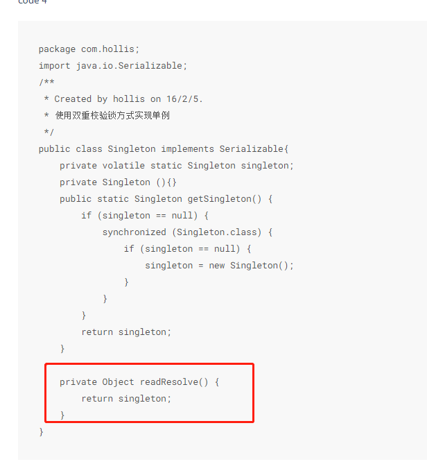  

# 抽象工厂模式
符合开放-封闭原则。对扩展开放，对修改封闭。
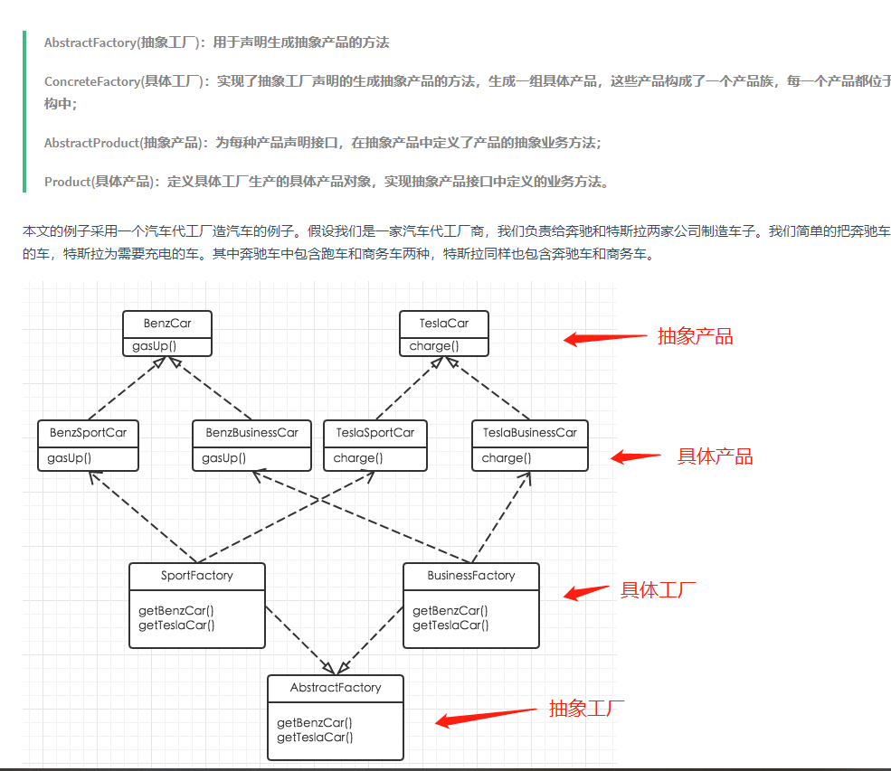  

# 建造者模式

# 工厂模式

