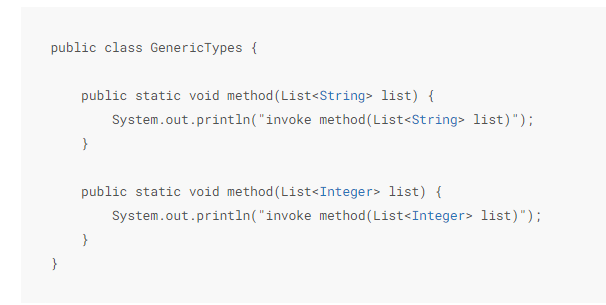
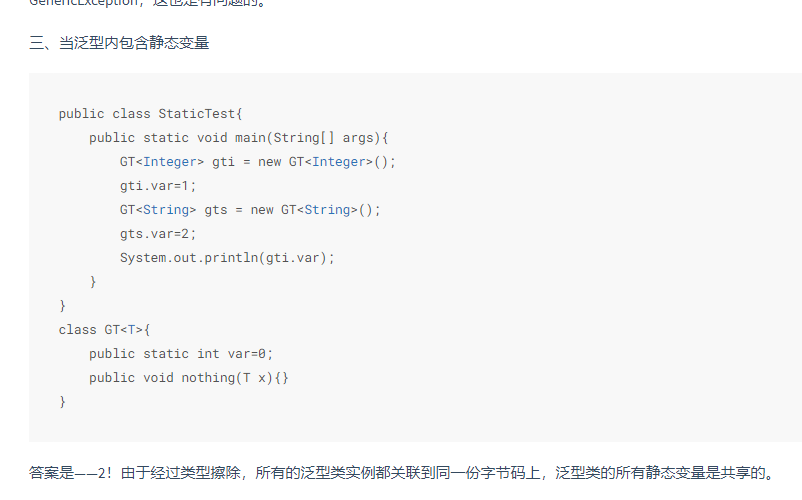
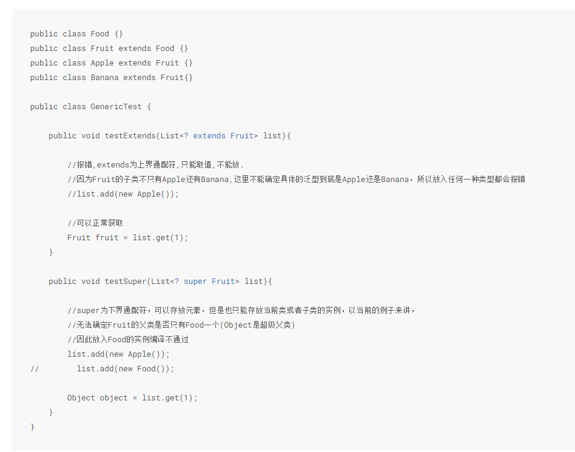

# 泛型的问题
## 泛型&重载：

会编译不通过，因为泛型擦除之后，参数看成是一样的
## 泛型&静态变量：

因为没有List<Interget>.class,或者List<String>.class,他们都是List.class,所以静态变量是共享的。

# 泛型的KTVE
E element
T type
K key
V value
N nume
？ 不确定
SUV  第2,3,4个 type

# 泛型限定通配符
<? extends T> 就是T或者T的子类，只能get
<? super T> 就是T或者T的父类，只能add

