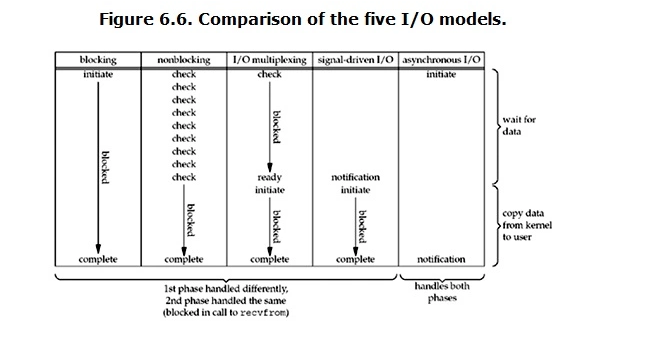

# 字符流
char=16bit

Reader、Writer ，使用缓冲区，不关闭流不输出任何内容
# 字节流
byte=8bit

OutputStream、InputStream，不用缓冲区

OutputStreamWriter：是Writer的子类，将输出的字符流变为字节流
InputStreamReader：是Reader的子类，将输入的字节流变为字符流

# IO模型

## 阻塞式IO
当用户进程进行read，如果内核数据还没准备好， 就会block用户进程，直到返回。
BIO。
data = socket.read();
阻塞时，会交出CPU。
适合连接数目比较小且固定
## 非阻塞式IO
当用户进程进行read，如果内核数据还没准备好，就立刻返回error，不block.但是会不断询问直到返回。

不会交出CPU,反而会一直占用CPU
## IO复用模型
NIO就是多路复用IO。
IO处理流，NIO处理块。
适合连接数目多且链接短。
### epoll和select和poll
都是多路复用机制。本质上都是同步IO，都需要在读写时间就绪后自己负责读写，就是说读写过程是阻塞的。  
select和poll只提供一个函数，select或者poll，epoll提供三个，epoll_create，epoll_ctl和epoll_wait  
select和poll需要自己不断轮询fd集合。select仅只有有IO，但不知道是哪个流，所以无差别轮询所有流，poll和select差不多，但他没有最大连接数限制，因为他是基于链表的。内核需要将消息传递到用户空间，需要内核拷贝。  
epoll没有描述符限制，套接字有回调函数，没有最大并发连接的限制。效率提升，不用轮询，FD数目多了也不影响效率。活跃可用的FD才会调用callback函数。通过内核和用户空间共享内存实现的。  
表面看epoll最好，但在连接数少且链接非常活跃的情况下， select和poll可能更好，因为epoll通知机制需要很多函数回调。  
## 信号驱动IO模型
## 异步IO模型
AIO
适合连接数目多且连接长

