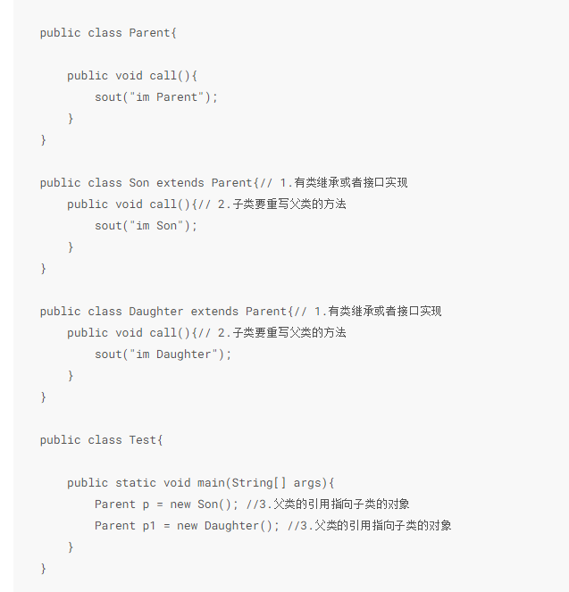
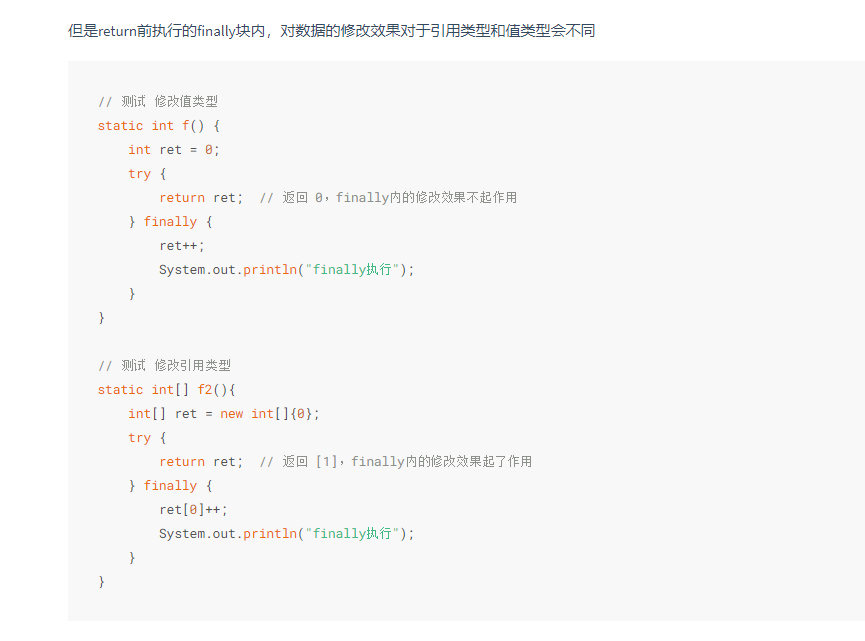
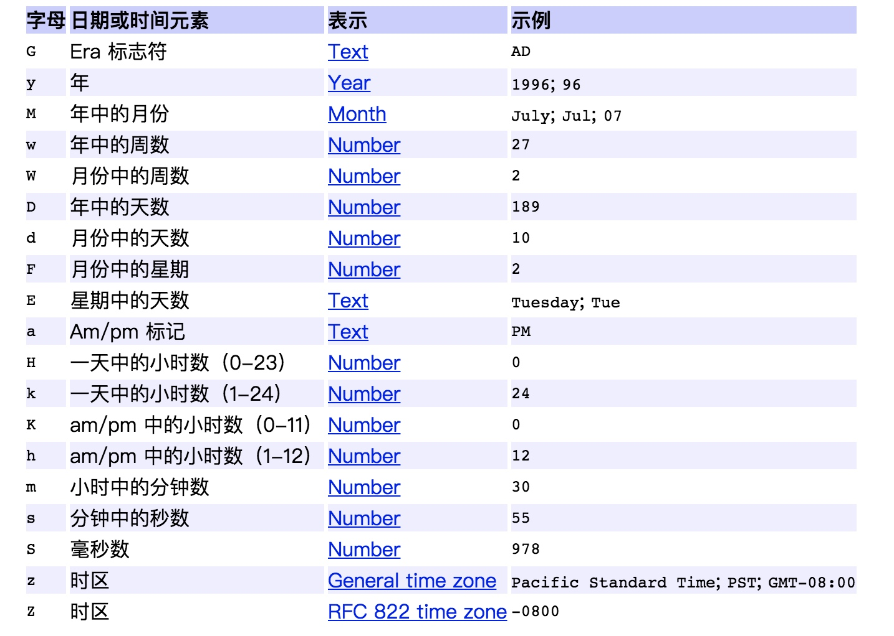
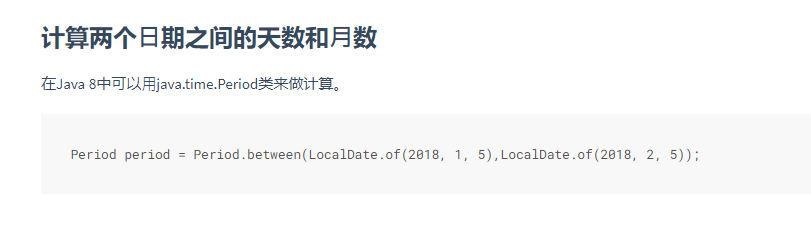
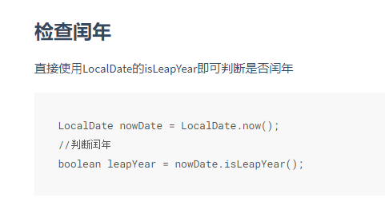

# 面向对象
## 三大特性
### 封装
### 继承
#### extends
可以定义属性方法，变量，常量
#### implements
只能定于全局常量（static final）和无实现的方法（java8以后又default方法）
### 多态
将子类传入父类参数，运行时调用父类方式通过传入的子类决定具体的行为。

虽然这里定义的时候就知道p是son，p1是daughter。但是有时候对象不是自己声明的，比如spring的IOC。
#### override重写。
是运行时的概念。
将父类得方法覆盖。方法名，参数，返回值相同，final方法不能重写。子类不能缩小访问权限，不能抛出更多异常，可以不抛出异常。public>protected>default>private
##### 方法作用域
###### public
所有类
###### private
当前类，子类都不行
###### protected
同一个包的类，除非子类
###### default
同一个包的类，子类都不行

#### overload重载。
是编译时的概念。（所以不算多态，非要算就是静态多态）
参数类型，个数，顺序至少一个不同，不能只有返回值不同，不然不知道用哪个。 父类/子类 同类都可以。

# 关键字
## transient
序列化的时候忽略他。反序列化的时候变成默认值。
## volatile
和synchronized差不多，但只可以修饰变量，不能修饰方法和代码块。
可以保持缓存一致性。当被他修饰时，写数据会把数据强制刷入主存。所以一个线程改变了这个值，其他线程立马可见。
禁止指令重排优化。
不保证原子性。synchronized可以（moniyorenter和monitorexit指令）
总结：
synchronized可以保证原子性、有序性和可见性
volatile只能保证有序性和可见性。性能好，不是锁所以不存在阻塞问题。
## synchronized
可重入锁。
他无法禁止指令重排，但是因为保证了单线程，所以保证了有序性。
## static
线程共享的，所以线程不安全
### static class 和 non static class：
static，只能访问外部类的静态成员，不能访问外部类的非静态成员。
non static，能访问外部类的静态和非静态成员。能访问外部类的数据和方法。

# 引用
## 1.强引用
只要强引用存在，垃圾回收器就不会回收这个对象。
## 2.弱引用
不管内存时候足够，都会回收。
## 3.软引用
## 4.虚引用

# try catch
try里如果有return，finally还是会执行（而且会先return finally的）。除非try里System.exit（0）。
但finally执行的修改只对引用类型起作用。

# Exception和Error
Throwable是最大的类。分为Error和Exception（Checked Exception 和 RuntimeException）

# Interface和abstract：
Interface,只能有成员常量，默认public static final，和方法得声明
abstract抽象类可以有成员变量，声明普通方法和抽象方法。至少包含一个抽象方法就叫抽象类。

# for 和 for each：
数组结构用for，因为用下表，内存连续比较方便。
链表结构用for each

# Date
## SimpleDateFormat

线程不安全

# java8的时间
## 间隔天数

## 检查闰年

# 锁
锁的实现基于aqs，常用ReentrantLock ReentrantReadWriteLock 

