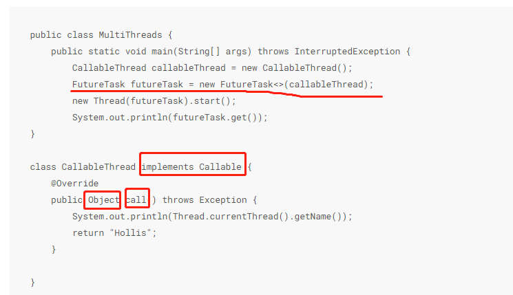

操作系统能运算调度的最小单位。
# JVM内存结构
方法区         栈  
堆               程序计数器
数组引用变量是存放在栈内存中，数组元素是存放在堆内存中。
## 堆：
存放对象实例。分为老年代和新生代，新生代分为eden，s0，s1 。s区总有一个是空的。  
-Xms设置堆的最小空间大小。  
-Xmx设置堆的最大空间大小。  
-XX:NewSize设置新生代最小空间大小。  
-XX:MaxNewSize设置新生代最小空间大小。  
有垃圾回收+OOM  
## 方法区：
类信息，常量，静态变量。  
很少垃圾回收+OOM  
## 栈：
基本数据类型，对象的引用。编译时完成分配空间。  
-Xss控制每个线程栈的大小。  
SOF+OOM  
## 程序计数器

# Java内存模型（JMM）：
就是两个线程间怎么通信的

# 线程的实现
## 继承Thread
## 实现implements
## Callable和FutureTask
可以拿到线程的返回结果。  

